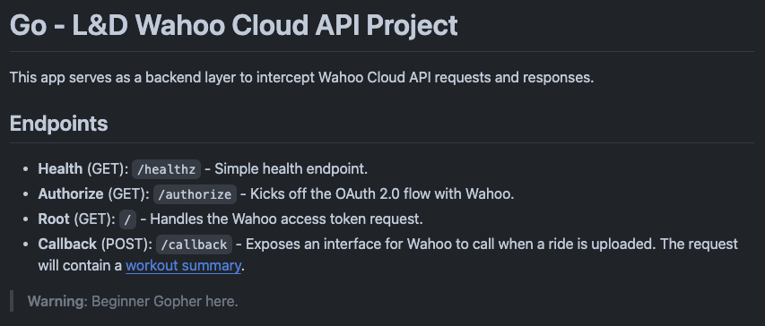

<iframe class="w-16 sm:w-8 md:w-32 lg:w-48" src="https://giphy.com/embed/nuSGIWVeHOpF442G3m" frameBorder="0" class="giphy-embed" allowFullScreen></iframe><p><a href="https://giphy.com/gifs/fallontonight-mario-chris-pratt-wahoo-nuSGIWVeHOpF442G3m">via GIPHY</a></p>

## Introduction

I have been using Wahoo products for a while now and I have to say that I am a big fan. I have used their bike computers, heart rate monitors, their smart trainers. As an avid lycra-wearing bloke, 
they have been my go to toolset for cycling. As stated a few times on this blog, I'm also a techie and I love to tinker with things. So when I found out that Wahoo had an API, I thought I'd take the opportunity to have a play.

If you're not familiar with [Wahoo](https://uk.wahoofitness.com/) they are a fitness technology company that has been around for a while now. They offer a range of products that are designed to help you get the most out of your workouts.

It's a bit cheeky of me, but I have done a similar exercise with [Kotlin and http4k](https://jamesmillner.dev/blog/2023/07/19/code-cadence-wahoo-http4k/), but I've added a lot more testing, and the Fly integration here is very slick and neat. So stay tuned!

## The Wahoo API

As per the [Wahoo Developer Documentation](https://developers.wahooligan.com/cloud) the API is a RESTful API that allows you to access your workout data. 

> The Cloud API allows you to connect Wahoo users directly to your mobile and web applications. Using the OAuth2.0 standard protocol, the API authorizes login/connection to Wahoo, and supports managing profile data, heart rate and power zones, and the upload/download of workout data to the cloud.

## Why Go?

Well to be completely honest I really wanted to simply try something new. I've used bits of Go briefly in a hobby capacity in the past, but I've never really had the opportunity to use it in a professional capacity. So I thought this would be a good chance to get my hands dirty with it.

There are a few reason's I thought I'd use Go for this project:

* It's fast AF. Seriously, it's quick.
* Go has a strong community behind it, and there's lots of resources available.
* It's a language that I've not used much, so it's a learning opportunity.
* Although since it's a language that I've not used much, it's a challenge!

I haven't reinvented the wheel with this project. It's a very slim application, but it offers some key functionality which I think sets some good foundations for future development.

### The Positives

Well crikey it's fast! I mean really fast. I've not done any performance testing on the application, but I can tell you that it's super quick. I've not had any issues with the application so far, and I've been using it for a few months now.

The very fact that Fly can spin up the instance, and boot the application in milliseconds is a testament to how quick Go is. Well and [Fly](https://fly.io/), but that's another article!

Also testing in Go has been really easy. I've used the built-in testing framework, and it's been a breeze. I'm fairly pleased with the level of test coverage I have for the application. Don't get me wrong, its no perfect, but for a brief endeavour, I'm happy with it.

Furthermore, I've been able to fully integration test it with a Wiremock docker container. This has allowed me to test the application in a real world scenario, and I've been able to test the application with real data. 

Simply the ease of setting that up has been a real positive for me. Certainly confidence inspiring! 

### The Negatives

Ah, I hate to say it, but I do find Go's approach to error handling a bit cumbersome. While I write this in the 'Negatives' section I wince as I write this, as I can certainly see the benefits of it. 
But having to check for errors after every function call can be a bit of a pain. I've found myself writing a lot of boilerplate code to handle errors. 

Though the tricky thing here is that Go is designed to be simply and easy to read, and there's no denying that the error handling is simple and easy to read. So I guess it's a bit of a trade off.

However, I couldn't do the article justice without being honest about it. It's a mile away from my walled JVM garden.

## The Application



Simply it offers the ability to:

* OAuth with Wahoo to gain an API Access Key
  * I may intend to go a bit further with this. I'd like to store the access token in a database and refresh it when it expires. This would allow me to have a long running service that can access the API without the need for user intervention.
* It hosts the callback endpoint to allow wahoo to ship my FIT files to the application for processing.
  * At the moment I simply store these as a backup. I'd like to process them and store the data in a database for further analysis.

The application is available on [Github](https://github.com/james-millner/go-wahoo-cloud-api)

I've also deployed it on [Fly](https://fly.io/). It's a great platform for deploying applications, and I've been really impressed with it so far. It's also not cost me a penny, which is a bonus!

Fly also offers really neat object storage through Tigris. I've been using this to store the FIT files that Wahoo sends me. Although I've not done anything with them yet, it's a nice feature to have.


If you're a Wahoo user, and you're interested in the application, feel free to give it a go. I'd love to hear your thoughts on it.

If you navigate to the GET root endpoint it will give you back a JSON payload with your wahoo access key. This is not stored by the application, so you'll need to keep hold of it.

```json lines
{
  "access_token":"<<my-super-secret-token>>",
  "token_type":"Bearer",
  "expires_in":7199,
  "refresh_token":"<<my-refresh-token>>",
  "scope":"user_read workouts_read offline_data",
  "created_at":1724797328
}
```

This is the key to interact with their API. You can then use this to interact with the Wahoo API to pull down your workout data. I may look to expand on this in the future, but for now it's a good start.

## Conclusion

I've really enjoyed working on this project. It's been a great learning experience and one I should do more of.
I've been able to get my hands dirty with Go, and been able to learn a bit more about the Wahoo API.

To check out the full source code, head to [Github](https://github.com/james-millner/go-wahoo-cloud-api). Fork it, clone it, have a play with it. I'd love to hear your thoughts on it.

I'd like to try and pair this with my [Kotlin Fit Converter](https://jamesmillner.dev/projects/4-kotlinfitconverter/) project in some sort of multi-language backend processing pipeline. 
Who knows? That could be a future project!

