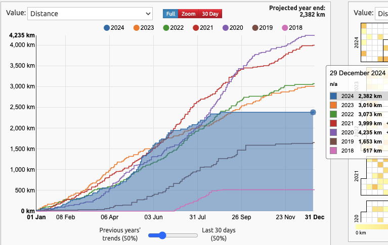
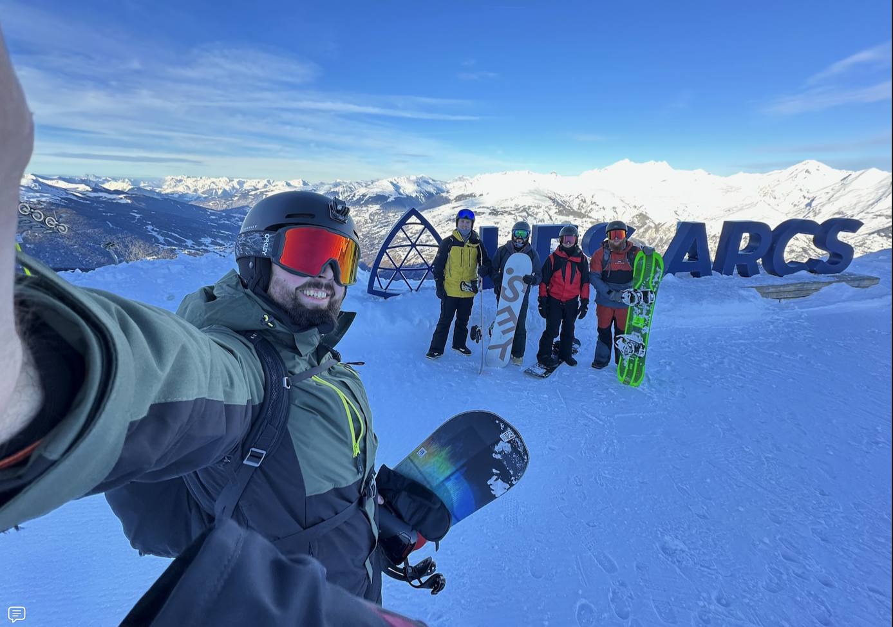

As 2024 draws to a close, I happened to stumble on a post by Max over on BlueSky that hit me for six:

<blockquote class="bluesky-embed" data-bluesky-uri="at://did:plc:d5umsb2ibiw7hzqkiwcs4sb7/app.bsky.feed.post/3legnlz4cis2z"
data-bluesky-cid="bafyreidpjm2gqmnh37eqrge5d2y7lbiu5gv6353mh4tti7crhpustg5rey">
✏️ Bloggers: It&#x27;s time for 
your annual year-in-review posts! I really like reading these - if you have one, let me know!
&mdash; Max Böck (<a href="https://bsky.app/profile/did:plc:d5umsb2ibiw7hzqkiwcs4sb7?ref_src=embed">@mxb.dev</a>) <a href="https://bsky.app/profile/did:plc:d5umsb2ibiw7hzqkiwcs4sb7/post/3legnlz4cis2z?ref_src=embed">Dec 29, 2024 at 8:57</a></blockquote>

It has only felt like two minutes since I set up this site. I was a bit taken aback by this post. I had such grand
intentions of posting here more frequently and sharing more about what I've been up to. 

The last time I wrote something like this was back in [May 2023](https://jamesmillner.dev/blog/2023/05/11/blowing-off-the-cobwebs-spider_web/) 
after the birth of my Daughter. 2024 has been such a <b>big year in so many ways</b>, I felt inspired to put the keyboard to work and jot down some thoughts.

## Fatherhood 

By far, the biggest theme of the year which has been full of firsts. My soon-to-be 2-year-old has conquered many firsts this year and has taken champion
position in my daily life. Now don't get me wrong, it's been challenging, tiring and an emotional experience. I'm a changed man because of it.

I wouldn't change a second of it. While we're still so early on in our journey as parents, I couldn't be more proud of the confident, 
charming and intelligent small human developing before my eyes. Now sorry if that's boring, but I wanted to shout from the 
top of this post a big theme for 2024. 

She has and continues to capture my undivided attention. She's walking now more than ever, and I'm quite excited about the upcoming adventures we can go on together 
and in the future.

## Proposal (Late Edit!)

Crikey after looking back on photos from the year, I'd missed a big one.
I finally plucked up the courage to ask my partner of 10 years to marry me.
Thankfully, she said yes!  

It's not the most traditional route, granted, but I've long thought it's been the right thing to do.
I'm incredibly lucky to have such a special partner in my life, and we're excited to make official what we've known for a long time.

## Professional Work

2024 started out as a big year for my company at [10xBanking](https://www.10xbanking.com/) a SaaS core banking platform that I've 
been working with for around 2 and a half years. 

The business has changed dramatically during my tenure, which has been incredibly exciting and stressful at the same time. However, that is the life of a 
start-up business, 10xBanking certainly adapted well, and I'm proud of the work I achieved there in 2024. I'm very proud to have worked on their meta-core offering,
which really enables so many different banking offerings through a polygot experience!

I think the business is positioned well for 2025, and it'll be great to see what 10xBanking will achieve in the future.

However, even with the said, I’ve taken the decision to leave [10xBanking](https://www.10xbanking.com/) and move onto a new opportunity that starts early in 2025. More on that soon though!

## Personal Work

This feels short but sweet, and while internally I don't feel there is _a lot_ to share, that's doing myself an injustice. 

I've worked more in Go this year than ever before, both professionally and personally. This has been a real learning opportunity and
it's been very worthwhile. It's made me reflect more on my engineering choices across the board. It's made me think more simplicity, handle side effects 
gracefully and meaningfully. There's a lot more I could go into, but I won't bore you with the details. Go is cool. 

But I started the year with wanting to explore more outside the JVM. I'd dabbled briefly in the rust space, and would like to continue evaluating it's offerings.

While the JVM offers a lovely walled garden, there's one thing for certain in this industry; you never stop learning.
However, that's true in general in life too.

I also did some hobby work back in Kotlin, which was nice. I worked with the Wahoo API to help me take back full ownership of the FIT files produced
by my cycling computer. Small work, but fun work nonetheless. All hosted and running in [Fly](https://fly.io) for free. [Check out my post here for more details](https://jamesmillner.dev/blog/2024/08/27/go-ing-wild-with-wahoo/).

## Moving Home

This could be an entire post of its own, but I'm not sure if I can put into words yet a sensible post about it all. It's been a lot of work.

Halfway through the year in June, we viewed a property that came back onto the market that we missed out on prior. We jumped at the chance to swoop it up. After a 3 and a half month solicitor duel we got the keys to our new home. The home is far from new. It's a 1901 Edwardian property that was a happy family home
to a local family for many years. 

It's taken a lot of effort, DIY and renovation to get into, but we moved in at the start of December. Some of the achievements:

* Removed a Fireplace.
* Bricked up a hole in the wall.
* Insulated a suspended floor.
* Taken down a stud wall, gracefully.
* Reclaimed / reused all the stud wall wood for Heat Pump / House Server Equipment.
* Stripped wood chip wall paper (never again...)

RE Heat Pumps, you might be in shock, awe or simply be aghast at the thought of a heat pump in such an old property. Once I've amassed 
some more data from our setup, a goal of mine is to extract some data and write up our experience. I've become a bit 
obsessed with the likes of heat geek. Simply put for now, I'm very pleased with how it is operating. We consistently
have a comfortable house, and we aren't even fully insulated, nor even having flooring in parts!

We've got plenty more work to do, but I'm just thankful that we're in, and we're lucky enough to be on this journey.

## Fitness

Witness the fitness, at least you could say that for the start of 2024. 

With Cycling being my favourite past-time, it was a bit disappointing to finish the year with less distance. My goal was to top the 3,000KM achieved 
in 2023. This was on track funnily enough just before we viewed the house. But it's no crying shame! Onwards to 2025!

There's also a huge note to call out here. I was very lucky to go on a snowboarding holiday with some close friends of mine at the start of the year. 

It's been a long time dream of mine to actually do this, and it was really neat to achieve this. They've got me hooked! I'd love to go again soon, but crikey they’re expensive.

However, there were some more big wins here in 2024 for fitness. To name a few:

* 100KM on a single Zwift ride!
* My Longest MTB ride: 74KM
  * Technically a gravel ride, but my trusty hardtail Marin during a <b>very very wet</b> ride came in handy
* Ran my first ever official 5K with a time of 35:24

## 2025 Onwards

Thinking into 2025, I'm going to finish of the lul between Christmas and New Year to finalize some of the goals I'd like to achieve in the new year before 
starting a new position in January. Very excited to see where that will take me.

I'm not putting lots of pressure on myself to set out a grand list of goals, nor try to only build the next big thing. I'm going to continuously prioritize being
a good father and partner, and be there for loved ones.

Although that distance goal... I'm coming for you 2023! The title will hopefully be 2025's!