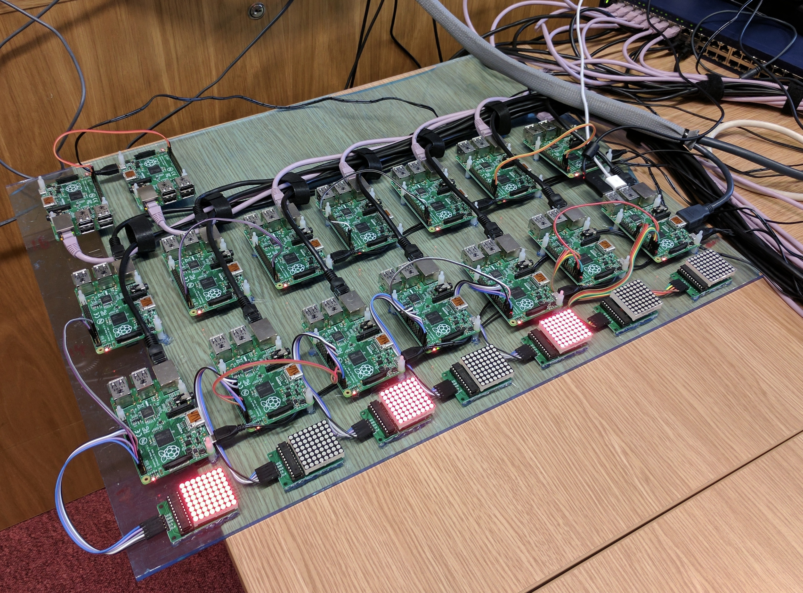
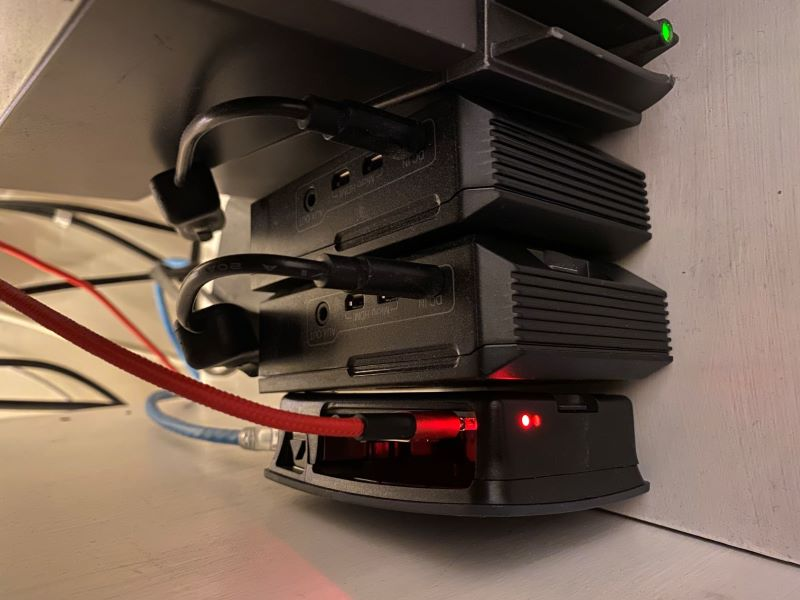
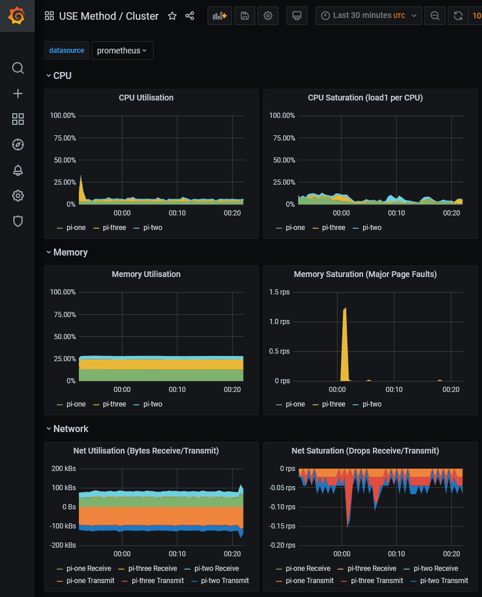
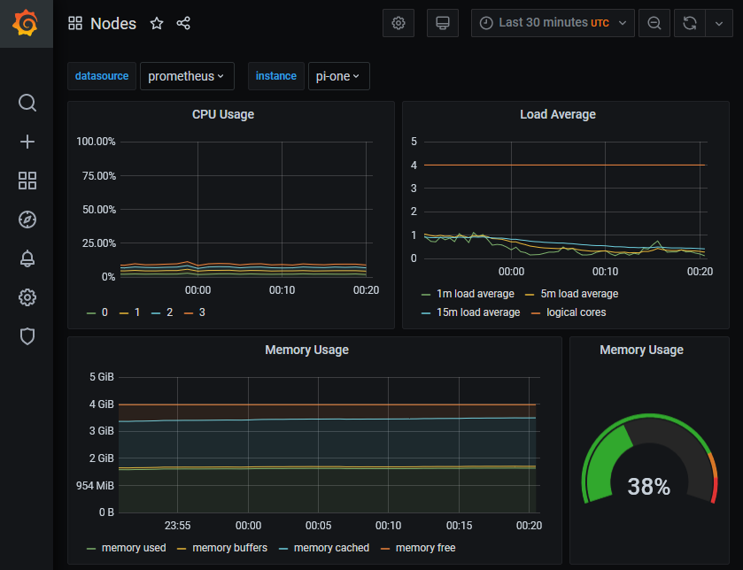
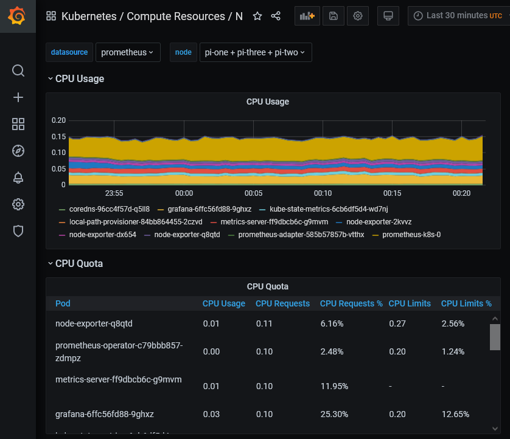


New article!


# Happy Raspberry Pi Day!

I'm a day late writing this, but seeing that yesterday was Raspberry Pi day has prompted me to put some words out about 
my experience with Raspberry Pi's - and a bit of a tutorial on how to set up what I have running currently.

## My Raspberry Pi Background

I've always been interested in Raspberry Pi's due to the low barrier to entry, and their compact design. I mean a computer the size of a credit card?! 
I remember nerdly thinking that this was *so cool*, and to be honest I still do!

I got my first Raspberry Pi back in 2018 - the 3 B+ model. At the time I only had the Pi itself with an SD card, and some cabling to hook it up to my router and to power it on. 
It's a relatively cheap piece of kit to acquire in the UK. Nowadays, you can get [a starter kit](https://thepihut.com/products/raspberry-pi-starter-kit)
for around £50, which will give you the essentials to get a machine up and running. 

They can be used for all sorts of wacky and wonderful ideas but at their core they are a tool to:
* Learn programming languages
* Understanding operating systems and system level operations
* IoT style development
* Home automation
* Clusters and edge computing 
* and more!

I was introduced to the University of Huddersfield demo Raspberry Pi cluster which really piqued my interest in them originally.



Unfortunately I wasn't able to find any further information online from when this project existed at the University, but since there
has been some cool research published from the University of Huddersfield using them. I'll link them here for anyone interested in the studies:

* [An Asus-xtion-probased Indoor MAPPING Using a Raspberry Pi with Turtlebot Robot Turtlebot Robot - Dr Voileta Holmes, Dr Hamza Aagela & Maha Al-Nesf](https://pure.hud.ac.uk/en/publications/an-asus-xtion-probased-indoor-mapping-using-a-raspberry-pi-with-t)
* [Implementing a Lightweight Cloud-Based Process Monitoring Solution for Smart Agriculture - Daniel Clarke, Dr Hussain Al-Aqrabi, Prof Graham Hill, Dr Pritesh Mistry, Philip Lane](https://pure.hud.ac.uk/en/publications/implementing-a-lightweight-cloud-based-process-monitoring-solutio)

However, I must admit, when I got my [Raspberry Pi 3 B+](https://en.wikipedia.org/wiki/Raspberry_Pi) I didn't do too much with it.
I loaded up Raspbian (_a Debian based linux distro specifically designed for Raspberry Pis_) and tinkered with it. After that point it sat as a bit of a paper weight.

Due to the ease of use, I used to flash it back to normal time and time again - to repeatedly set it up. But I saw lots of projects setting up
retro gaming consoles, pi robots, hue lighting automation. I never got that far, but never forgot about the trusty Pi!

These devices are a great learning tool at any stage of your development! It opens up loads of possibilities to learn all about computing in an accessible way. 
There's a shed load of support available online in the form of the [Raspberry Pi Foundation website](https://www.raspberrypi.org/), the [Raspberry Pi Forums](https://forums.raspberrypi.com/), and generally all over the internet.

## My Own Raspberry Pi Cluster

At Sky Betting & Gaming, in the technology space we are a big Kubernetes house. Lots of our infrastructure runs on Kubernetes, and we've got lots of automation around it to enable all our squads to utilize it.

Now Kubernetes isn't particularly lightweight, 
or so I thought before I discovered [K3s](https://k3s.io)

>Lightweight Kubernetes. Easy to install, half the memory, all in a binary of less than 100 MB.

_Sourced from: [https://rancher.com/docs/k3s/latest/en/](https://rancher.com/docs/k3s/latest/en/)._

Now I was asking a bit much of my 3 B+ to run this on its own. So I invested in two Raspberry Pi 4 (4GB) models, one to run as the controller node, and a subsequent worker.
This gave me a compute pool of:

* 1x Raspberry Pi 3 B+ (1GB)
* 2x Raspberry Pi 4 (4GB)

### What do I do to set this up?

To get up and running the first step is to flash a fresh operating system to the SD cards. In my case, an installation of Raspbian on all the SD 
cards I planned to insert into the Raspberry Pis. Raspbian is what this post follows, but if you want tips on other OS's please reach out! 

Historically you could download an ISO of your choosing, then use a disk imaging tool to flash that OS to the card.
That's still possible today of course, but there's now a [dedicated tool](https://www.raspberrypi.com/news/raspberry-pi-imager-imaging-utility/) provided by the
Raspberry Pi Foundation to help you on your way! This tool will format and flash your OS images for you, it'll also allow you to use a custom ISO too. It's really neat :thumbsup:, and I'd recommend this route.

Once I'd flashed all the images it was almost time to assemble them and power them on. I wanted to operate them all headlessly, which the section below covers.

#### Headless Pi?

If you want to run the Pi's heedlessly. Which essentially is running the Pi's with out a GUI. I wanted to SSH onto them and configure them all via a terminal. To do this, you'll need to add an empty file named `ssh` to the root of your volume. 

It's as easy as changing directory into that new volume using the terminal of your choice and running:
* `touch ssh` on MacOS / Linux. 
* `New-Item ssh -type file` on Windows Powershell

This will tell the Pi on boot to enable SSH. Safely eject your SD card and begin assembling!



Once you power the Pi on. You'll be able to SSH to it over your network by running:

``
ssh pi@<your-raspberry-pi-ip-here>
``

It'll ask you for a password, which, if you selected Raspbian the default will be `raspberry`. Then afterwords, if you've been successful you'll
get the following response:

````
➜  James Millner $ pi-one
Linux raspberry 5.10.92-v8+ #1514 SMP PREEMPT Mon Jan 17 17:39:38 GMT 2022 aarch64

The programs included with the Debian GNU/Linux system are free software;
the exact distribution terms for each program are described in the
individual files in /usr/share/doc/*/copyright.

Debian GNU/Linux comes with ABSOLUTELY NO WARRANTY, to the extent
permitted by applicable law.
Last login: Mon Mar 14 23:29:54 2022 from 192.168.1.29

Wi-Fi is currently blocked by rfkill.
Use raspi-config to set the country before use.

pi@raspberry:~ $
````

Then the world is your oyster! You've successfully set up a Raspberry Pi! :raised_hands:

Before I continue here - one step I like to do after setting these up is instantly rename the hostname of the pi. To do this, run:

`sudo raspi-config` (On Raspbian only)

This will give you the option to change the hostname. I opted to change them to be pi-one, pi-two and pi-three. 

### Configuring a K3s cluster

Now this is where it gets good. It's only a handful more steps, and you'll have a lightweight version of Kubernetes to play around with.
All credit here goes to the [documentation](https://rancher.com/docs/k3s/latest/en/installation/install-options/) at Rancher, its brilliant.

Firstly select the node which you would like to be the controller. Bear in mind this will still operate as a node, but it'll be the main controlling node. 

On that node, run: 

```
curl -sfL https://get.k3s.io | sh -
```

This will go off and install K3s on that host. To confirm K3s is set up correctly you can run:

```
sudo systemctl status k3s.service
```

Which if successful, should return:

````
● k3s.service - Lightweight Kubernetes
     Loaded: loaded (/etc/systemd/system/k3s.service; enabled; vendor preset: enabled)
     Active: active (running) since Mon 2022-03-14 23:26:50 GMT; 23min ago
       Docs: https://k3s.io
```` 
_This response is trimmed down from the full systemctl response. The main attribute we're interested in here is the *active flag*_

### Kube Config

Now you have a node! Now k3s will have configured a config file to interact with the cluster, make a copy of this. You can find it by running:

```
sudo cat /etc/rancher/k3s/k3s.yaml
```

Now if you want to test your k3s cluster remotely then you'll need kubectl configured. If you don't want to install kubectl, it's not required, but it can make life easier.

#### Without Kubectl - Locally

K3s installs an instance of kubectl on your nodes. If you hop onto your controller node, and run the following:

```
pi@pi-one:~ $ sudo k3s kubectl get nodes
NAME       STATUS   ROLES                  AGE   VERSION
pi-one     Ready    control-plane,master   31m   v1.22.7+k3s1
```

You should see this lovely output to say that its setup correctly!

#### With Kubectl - Remotely

If you take the contents of `sudo cat /etc/rancher/k3s/k3s.yaml` and set them up on your own host under `~/.kube/config` you'll then be able to use kubectl remotely.

One thing to note, the kube/config file by default will have the cluster server set to localhost. To access this remotely, you'll need to change this to your local IP of that node: `192.168.*.*:6443`. 
Look in that config file and find the location clusters -> cluster -> server and make the change there.

This guide presumes you already have kubectl installed, if you don't head [here](https://kubernetes.io/docs/tasks/tools/) to find out how to install it.

Upon running `kubectl get nodes` you should see something like this:

```
➜  James Millner kubectl get nodes
NAME       STATUS   ROLES                  AGE   VERSION
pi-one     Ready    control-plane,master   21m   v1.22.7+k3s1
```

That's your first node installed! Now onto the other nodes. This is where the process slightly differs and this because you've just configured your controller node.
We'll now need to configure some worker nodes.

To do that, head back onto your controller and run the following command:

```
sudo cat /var/lib/rancher/k3s/server/node-token
```

This will return you a token, keep this safe. You'll need it next to configure the workers.

Now the next command takes that token and uses it to allow that worker to join the cluster. Keep it safe. Prepare the following command that contains:

- Cluster Access Token
- Controller Local IP

```
curl -sfL https://get.k3s.io | K3S_URL=https://<controller-node-ip-here>:6443 K3S_TOKEN=<my-super-secret-k3s-token> sh -
```

Once you have the command, run that on each host that you want to join the cluster. Now once that's run, just as before - make 
sure that systemctl reports the service as healthy by running `sudo systemctl status k3s.service` on each new host.

Once you're happy run the `kubectl get nodes` command, and you should see a happy set of nodes ready for some work!

Without Kubectl - Locally
```
pi@pi-one:~ $ sudo k3s kubectl get nodes
NAME       STATUS   ROLES                  AGE   VERSION
pi-two     Ready    <none>                 27m   v1.22.7+k3s1
pi-one     Ready    control-plane,master   31m   v1.22.7+k3s1
pi-three   Ready    <none>                 27m   v1.22.7+k3s1
```

With Kubectl - Remotely
```
➜  James Millner kubectl get nodes
NAME       STATUS   ROLES                  AGE   VERSION
pi-two     Ready    <none>                 16m   v1.22.7+k3s1
pi-three   Ready    <none>                 16m   v1.22.7+k3s1
pi-one     Ready    control-plane,master   21m   v1.22.7+k3s1
```

This covers the basics of getting a K3s cluster up and running. 

Now you can go ahead and run workloads on there, and K3s will balance work for you and away you go! Some takeaway points and notes:

* The Raspberry Pi's are all ARM based architecture. So anything you run on there will need to be ARM compatible. 
  * So look for ways to convert your AMD64 apps to ARM, and test them out on here! 
  * GoLang has some great tooling to build ARM apps, package them build, build a docker container and away you go!
  * Plenty of ARM based docker base images out there to make your applications compliant.
* K3s is fully [CNCF](https://www.cncf.io) certified and it conforms with the standard kubernetes API. It makes it the perfect demo cluster to get started with Kubernetes. If you can deploy something on K3s, you can lift and shift your YAML files and apply them to a larger scale cluster!

### Monitoring & Observability of your Cluster.

K3s has the support for [the Kubernetes Dashboard](https://rancher.com/docs/k3s/latest/en/installation/kube-dashboard/) but 
I'll be honest I didn't set that up as part of this demo.

We heavily use Prometheus and Grafana at Sky Betting & Gaming, so I was quite keen to replicate that. Now to save this post from becoming too long, 
I want to link out to [Carlos Eduardo's Cluster Monitoring Repo](https://github.com/carlosedp/cluster-monitoring) This has a wealth of instructions for setting up 
Prometheus, Grafana, Alertmanager and more! It also has support for K3s, but plenty of other Kubernetes setups.

Do check it out, as it can give you some great monitoring tooling for you cluster through prom-operator. It also gives you a solid interface so that you can 
scrape metrics from your own deployments. Here's some examples of the dashboards you get for free:







Overall I hope this blog entry has been useful to read! It's a first really as far as my own blog posts go, and I enjoyed writing it. 

If you have any questions, or want to know more head over to twitter and reach me there. All the links are below!

Thanks for taking the time to read this. Oh, and Happy Pi Day / Week 🍰