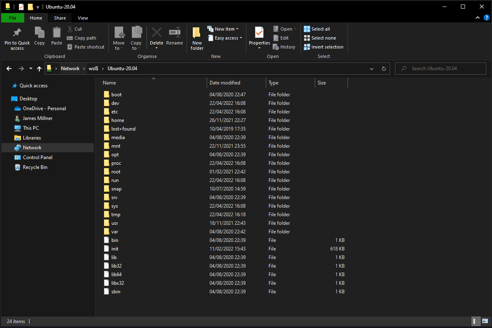
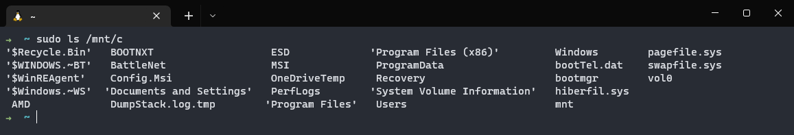
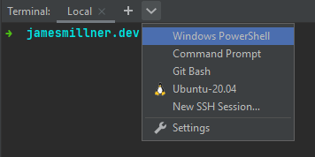
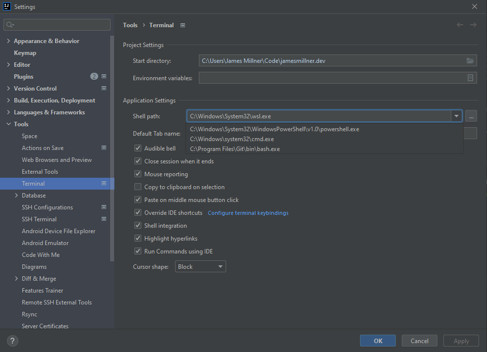
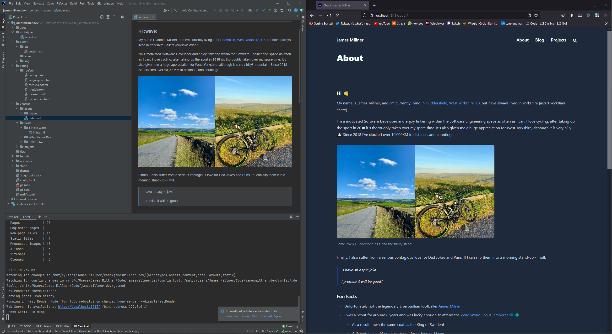
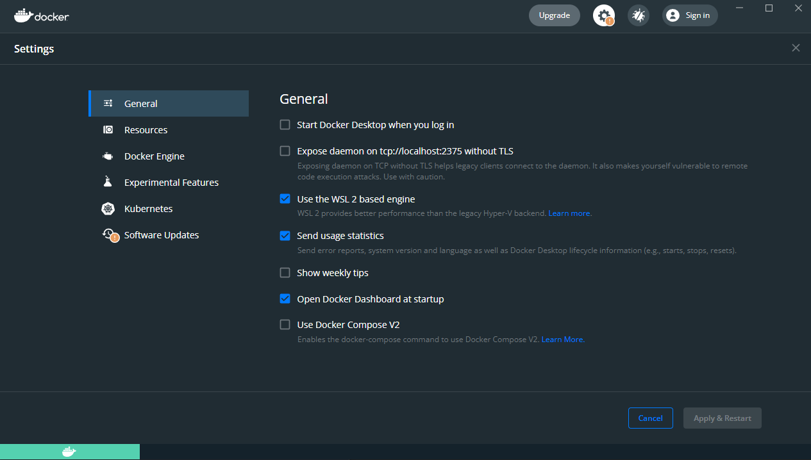
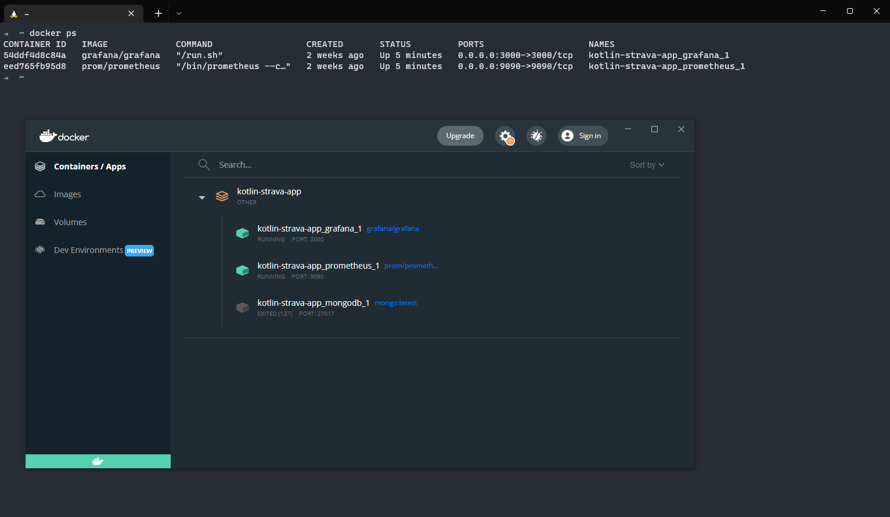

## Introduction

It's getting pretty late this April, and I've been thinking about what I could write about to post here this month.
So since April is coming to an end, and I was still struggling for inspiration, I thought I might write about my local development environment.
Specifically tailored around **Windows Subsystem for Linux**.

You might ask: 

>What is Windows Subsystem for Linux?

And it's a good question! In a nutshell; **it's a way to run a Linux environment directly on Windows. Without having to spin
up a virtual machine as and when you need it, or run a dual boot setup.**

Now I'm mostly in the macOS camp when it comes to my day-to-day work capacity. It's one of the more common software
developer machines I would hazard a guess. I currently work for Sky Betting & Gaming, and it's the development machine of choice there.
They're great machines. Ultimately they aren't too far from their Linux counterparts. 

I used to have a personal macbook, and I love the ecosystem there I must admit. After rebuilding my central gaming PC, I
thought I'd have a go at using that for local development! After all, I'd heard about WSL and how it had progressed.
This was my chance to really give it a try and its actually worked pretty seamlessly! So this post is dedicated to my
experience WSL, and how I've got things setup to do software development on Windows. 

## How I started with WSL

WSL has a suite of documentation that makes it quite easy to get up and running. You can find all the information about 
getting up and running with it on Microsoft's docs [here](https://docs.microsoft.com/en-us/windows/wsl/about).

WSL launched back in 2017 ([although Wikipedia suggests 2016](https://en.wikipedia.org/wiki/Windows_Subsystem_for_Linux)), 
and originally you had to be a part of the [Windows Insider Program](https://insider.windows.com/en-us/) in order to 
get access to it. However, more recently it is available publicly on the latest versions of Windows 10 and beyond. I 
won't go into the details of installing WSL in this article, I might do a further write-up of that down the line. Check out the 
Microsoft documentation its surprisingly easy!

WSL, at the time of writing, is supporting two versions - WSL 1 and WSL 2. All installations of WSL you would download now, all
fall to WSL 2 by default. When you [compare the versions](https://docs.microsoft.com/en-us/windows/wsl/compare-versions),
it's a good thing. WSL 2 is a really polished system for local development on Windows and has come along way since the initial version.

I briefly installed WSL 1 and had that up and running when it first launched. However it was more of an experiment to see
if I could get it working. I was amazed that Linux on Windows was a thing. It did work, and I could have made more of an effort to use it full-time. At
the time of installing it I still had a personal Macbook, so would fall back to using that out of habit. 

WSL 2 then launched in 2019 and shortly after that my partner was in dire need of replacing her old macbook development machine.
So I gave her my old machine. This meant I only worked from my work machine for some time. However I wasn't comfortable
doing much personal development on there. After all it was a corporate machine meant for work. At the time I had a gaming rig that got
a lot of attention with PC gaming. It wasn't until late 2020 / the start of 2021 when I rebuilt that rig and thought that I
should try to use what I had, rather than purchase another development machine.

## What do I use?

I use WSL primarily for developing backend Kotlin / Java applications. I also run Docker through WSL to support standing up and 
dependencies I might need, and general container workloads. I predominately use with [Spring Framework](https://spring.io/), but have been known to check out 
[Micronaut](https://micronaut.io/). I don't often do Frontend Development, its definitely something I need to get better at.
I guess you could class this site as some front end development, but I am leveraging a lot of Hugo really to get this setup.

Currently, I have Ubuntu 20.04.3 LTS setup on my instance of WSL. I have my Windows file system shared with Ubuntu so that 
I can make code available to my IDE of choice, Intellij. From there, rather than use Powershell (_shudders_) or the Windows CMD, I've
opted to download and install [Windows Terminal](https://github.com/microsoft/terminal). I then have Oh My Zsh setup as I would 
on my Mac system and away we go. 

It's not a fancy setup by any means, and its one I'm still learning how to play with, and tune to what I need. But it pretty 
closely mimics what I had on Mac.

### Filesystem Sharing 

Out of the box WSL allows you to easily share files between your chosen Linux distro. You can opt to mount network spaces too, I have a 
NAS internally that my Windows machine has access to, but I haven't mounted that space into WSL yet.

Here's some photo proof of the interop between Windows and Ubuntu: 

and vice versa from Linux to Windows:

So it's entirely interoperable! 

### Intellij Idea
  
Intellij for Windows has been great, and powerful for local development due to the fact I can spin up WSL terminal sessions with ease:

This is all configured directly through Intellij, all I've had to do is tell Intellij the additional shell paths I'd like to allow and away
we go:

### Local Web Apps!

Since I'm mainly driving all my development from inside WSL most of the functionality works out of the box. Here's some evidence 
of me running this website in WSL and accessing it in Firefox in windows. With no faff!!

WSL does support also running applications on Windows, and allowing access to them from inside WSL. For further information check 
out the documentation, but it wasn't a use case I was concerned with.

### Docker!

I did think that Docker might be the downfall of the setup. I couldn't get my head around how I'd get that to work on WSL, however thankfully the later 
versions of docker-for-desktop have support right out of the box. The entire process is handled for you, simply download docker-for-desktop on Windows and enable it:

## What's Missing?

To be honest, I've been able to do most of my day-to-day workflow from WSL - and I haven't noticed anything missing... yet. 
However, **I'm not an expert in WSL and nor do I claim to be in any capacity**. I'm sure under the hood there might be something 
that's not quite right, but for my needs of developing backend JVM applications and using Docker its worked brilliantly.

I'm genuinely interested in learning more about WSL, so if you have anything to share reach me on Twitter! I'll also
come back to this post and update with any frustrations.

## What's Next? 

Well, basically use WSL more! But there are a few things I'd like to try:

* I miss for instance from macOS was being able to perform commands such as `atom .` to open all files in a simple text editor.
  * It looks like its possible, but I haven't quite figured it out yet. Currently its abit manual process of opening atom, navigating to the path and opening that space. I do miss `atom .`
  * If you have any tips for this, please get in touch!
* Try and get a solid setup of my dotfiles. I've seen quite a few developers commit their dotfile setups, so I'd like to try to do something similar.
  * This would definitely help with writing up a how-to on WSL in future, as I could trash my current setup and write up a setup guide.
  * But also for any future development machines in general.
* I'd also like to try another Linux Distro. It looks like you can run more than one distro at once, and toggle between them with the WSL exe. So this would be neat!
* Watch the [Deep Dive!](https://devblogs.microsoft.com/commandline/a-deep-dive-into-how-wsl-allows-windows-to-access-linux-files/) Since I'm using it more and more, I'd like to learn how it works under the hood with windows.