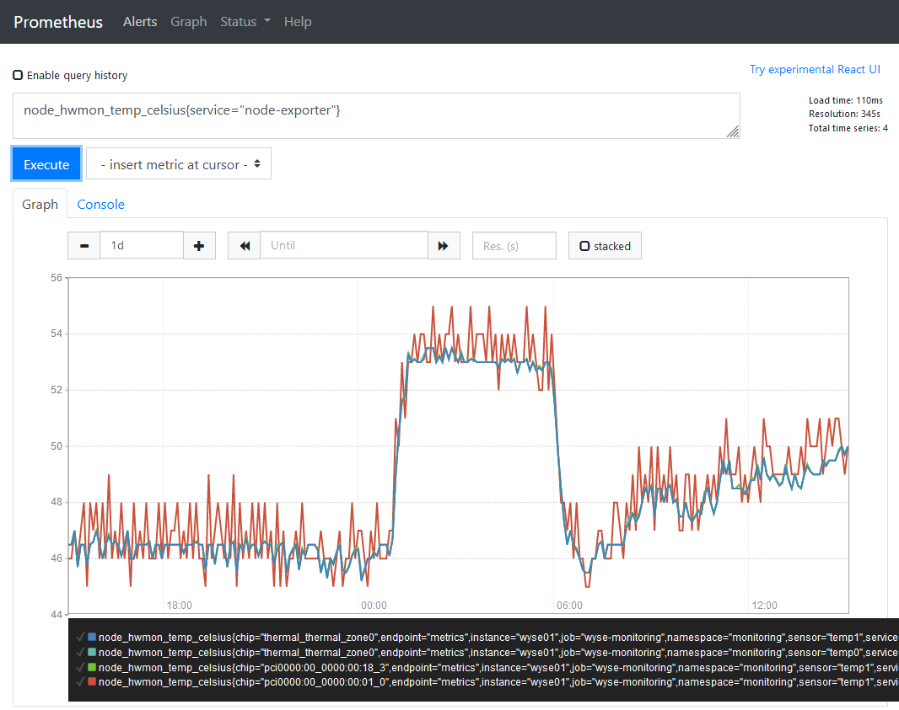
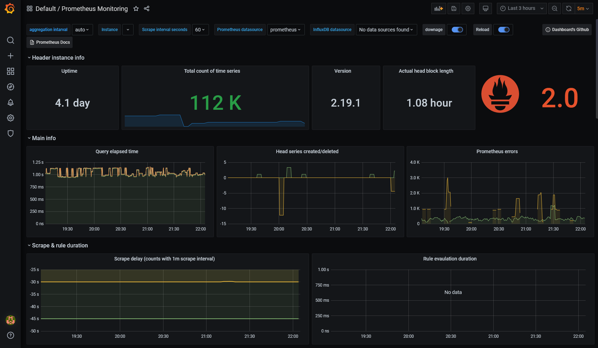
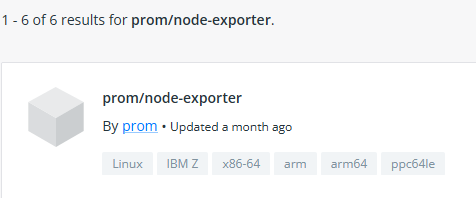
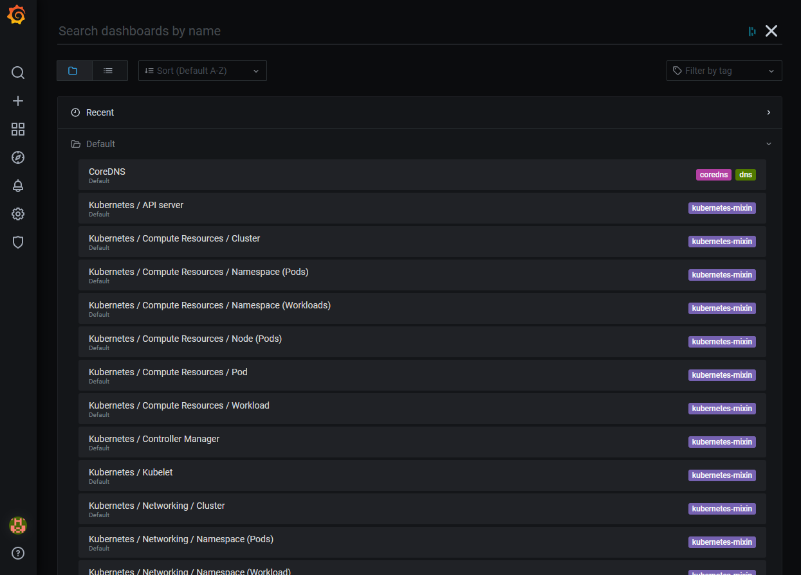
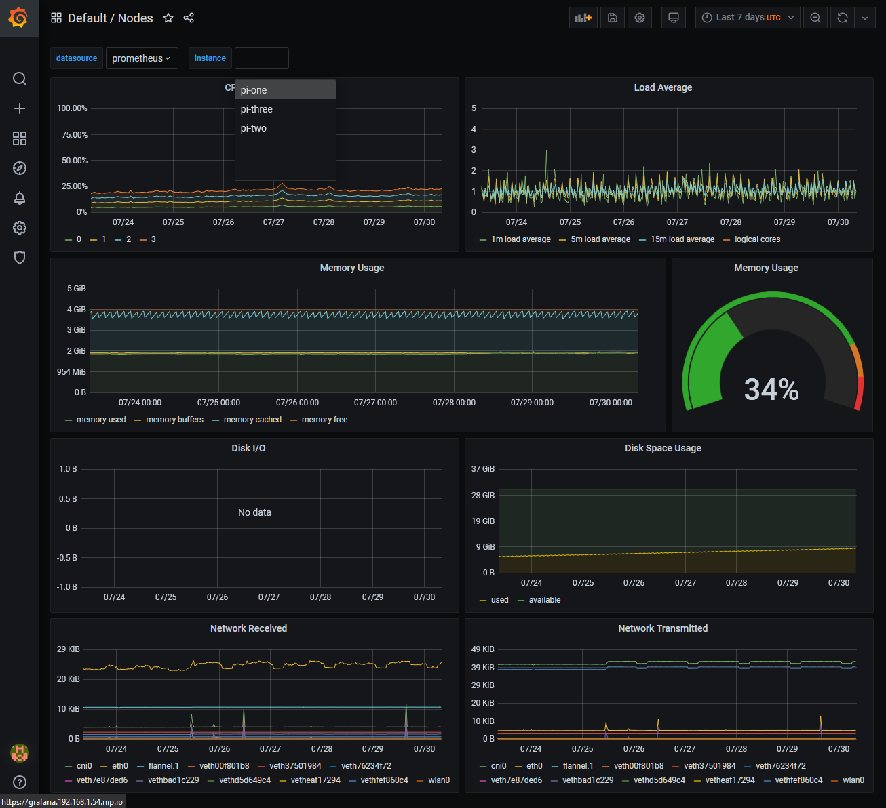
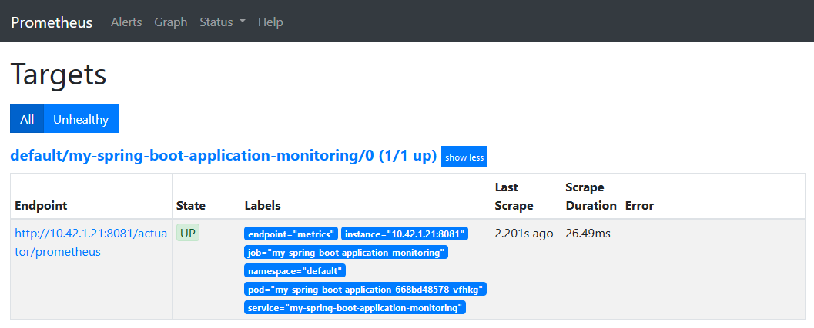
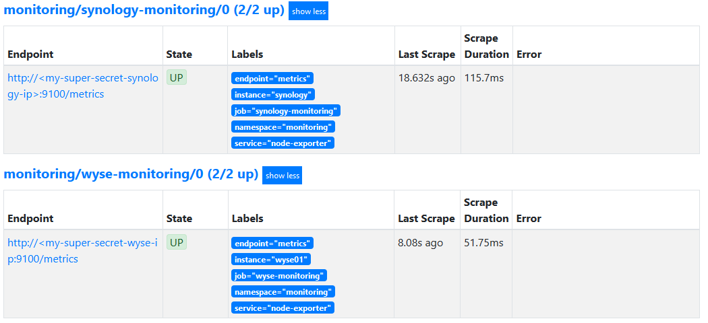
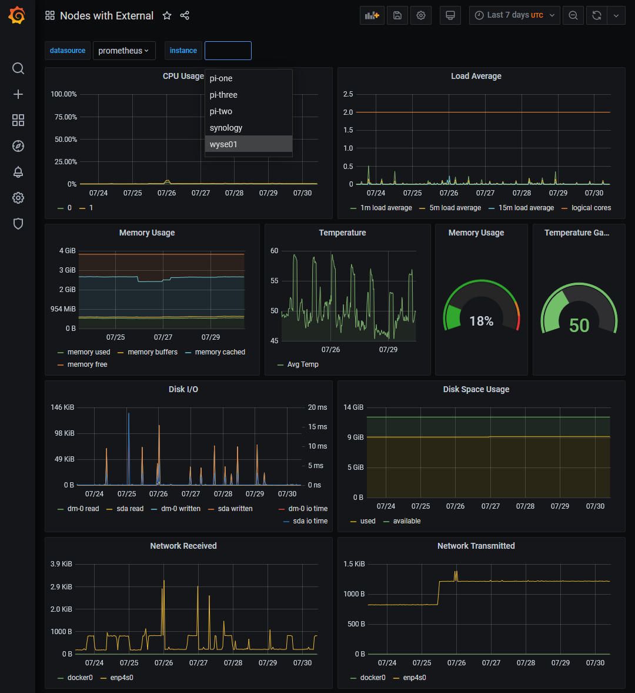

# My Tool Belt: Prometheus & Grafana 

One of the aspects of Software Engineering that I find particularly interesting is Monitoring & Observability. So this month I thought I'd whip up a small article on some work 
I've been doing recently in this space. It can be a part of the Software Engineering lifecycle that may often get overlooked, but having good monitoring over your applications is very powerful and a confidence inspiring position to be in. 
This post will cover my tool belt for this topic, and some bits of information for setting these up, with some examples.

## Background

I think that [Google](https://cloud.google.com/architecture/devops/devops-measurement-monitoring-and-observability) sums the two concepts up nicely:

>Monitoring is tooling or a technical solution that allows teams to watch and understand the state of their systems. Monitoring is based on gathering predefined sets of metrics or logs.

>Observability is tooling or a technical solution that allows teams to actively debug their system. Observability is based on exploring properties and patterns not defined in advance.

The tools that I primarily have experience with are [Prometheus](https://prometheus.io) and [Grafana](https://grafana.com/), which are both fantastic tools to get started in this space.

### Prometheus

In relation to the above, Prometheus is an example of a monitoring tool. It offers the functionality to gather, store and query metrics. Prometheus collects metrics over a period of time using a pull based model and allows you to customize the
frequency of how often it polls for data. 

This is typically done by applications and systems exposing HTTP endpoints for prometheus to scrape metrics from. Metrics for prometheus have to be presented in line format, separated by a line feed character (n) terminating 
the results by another line feed character (n).

Here's an example format of Prometheus metrics:

```shell
# HELP go_gc_duration_seconds A summary of the pause duration of garbage collection cycles.
# TYPE go_gc_duration_seconds summary
go_gc_duration_seconds{quantile="0"} 0.000153797
go_gc_duration_seconds{quantile="0.25"} 0.000218314
go_gc_duration_seconds{quantile="0.5"} 0.000236912
go_gc_duration_seconds{quantile="0.75"} 0.000247313
go_gc_duration_seconds{quantile="1"} 0.023042694
go_gc_duration_seconds_sum 2.477554883
go_gc_duration_seconds_count 1795

```

Prometheus has some configuration that enables you to define which applications or systems you want to target. When running bare-bones Prometheus you can provide a configuration file that looks a little something like this:

```shell
#Global configurations
global:
  scrape_interval:     10s # Set the scrape interval to every 10 seconds.
  evaluation_interval: 10s # Evaluate rules every 10 seconds.

scrape_configs:
  - job_name: 'application-monitoring'

    # Override the global default and scrape targets from this job every 15 seconds.
    scrape_interval: 15
    metrics_path: '/actuator/prometheus' ## Example Spring Boot metrics host.

    static_configs:
      - targets: ['application:8080']
        labels:
          application: 'application-monitoring'
```

This tells prometheus where each application / system lives, the HTTP endpoint to collect from and how frequently you wish to poll those metrics. With that in place, you can then use prometheus to query those metrics as shown below:



### Grafana

Grafana then on the other hand is the paired observability tool. It will allow you to take a view of the metrics you've gathered to explore their patterns and properties, and how they change over time. 
Grafana is an open source solution for visualising time series data. It's compatible with a whole host of data sources such as Prometheus, Graphite, Influx DB, ElasticSearch, MySQL, PostgreSQL etc.



## Getting Started

### Docker Compose

One of the simplest ways to get started I think is to use docker to stand up these apps and have a play around. I've created a public repository
that allows you to get up and running with these tools quickly:

[https://github.com/james-millner/local-prometheus-grafana](https://github.com/james-millner/local-prometheus-grafana)

The README in there contains some small tips on how to configure the setup further, but it's enough to get you up and running to try these tools out. It creates for you:

* An instance of Grafana already configured to talk to Prometheus as its default datasource
* An instance of Prometheus configured with a single target for metrics
* An instance of [Node Exporter](https://github.com/prometheus/node_exporter) which essentially makes system metrics available in Prometheus format

You can bake your apps into that docker-compose, or monitor them externally. This will allow you to monitor apps within the docker network, and outside it! Neat!

```yaml
version: '3'
services:

  prometheus:
    image: prom/prometheus
    restart: always
    ports:
      - "9090:9090"
    volumes:
      - "./prometheus/prometheus-config.yaml:/etc/prometheus/prometheus.yml"

  grafana:
    image: grafana/grafana
    user: "104"
    depends_on:
      - "prometheus"
    ports:
      - "3000:3000"
    volumes:
      - "./grafana/provisioning/:/etc/grafana/provisioning/"
    env_file:
      - ./grafana/config.monitoring
    restart: always

  node-exporter:
    image: prom/node-exporter
    container_name: node-exporter
    volumes:
      - /proc:/host/proc:ro
      - /sys:/host/sys:ro
      - /:/rootfs:ro
    command:
      - '--path.procfs=/host/proc'
      - '--path.rootfs=/rootfs'
      - '--path.sysfs=/host/sys'
      - '--collector.filesystem.ignored-mount-points=^/(sys|proc|dev|host|etc)($$|/)'
    restart: unless-stopped
    ports:
      - "9100:9100"
```

### Raspberry Pi! 

I've mentioned briefly before that I'm also quite passionate about [SoC](https://en.wikipedia.org/wiki/System_on_a_chip) computing, and using Raspberry Pis for this is a great use of them. 
Now, you could take the docker-compose setup from above and run that on the Raspberry Pi's, however you'd need to find some ARM compatible docker images so that the Pi's could run them. 

These are available now, you'll need to either find tagged images with `arm`:



### K3s

However, if you want to take it a step further, I would invest some time in looking at [K3s](https://k3s.io) - simply put, it's an incredibly lightweight kubernetes configuration, packaged as a single binary < 50MB. 
This will give you access to the formerly, Prometheus Operator stack, now named the [Kube Prometheus Stack](https://github.com/prometheus-community/helm-charts/tree/main/charts/kube-prometheus-stack)

This could be particularly of interest if you spend time around containerised applications. It'll also give you a local kubernetes context to play around with, albeit requiring the use of ARM compatible containers. 
However, at the very least it will give you a monitoring solution with a very low footprint on the Raspberry Pi units themselves. 

```
➜ kubectl get nodes
NAME       STATUS   ROLES                  AGE    VERSION
pi-two     Ready    <none>                 136d   v1.22.7+k3s1
pi-one     Ready    control-plane,master   136d   v1.22.7+k3s1
pi-three   Ready    <none>                 136d   v1.22.7+k3s1
➜ kubectl -n monitoring get pods
NAME                                  READY   STATUS    RESTARTS   AGE
prometheus-operator-c79bbb857-xfpfx   2/2     Running   0          7d21h
kube-state-metrics-6cb6df5d4-4vphr    3/3     Running   0          7d21h
node-exporter-qknh8                   2/2     Running   0          7d21h
prometheus-adapter-585b57857b-mjsh4   1/1     Running   0          7d21h
node-exporter-7m2p4                   2/2     Running   0          7d21h
prometheus-k8s-0                      3/3     Running   0          7d21h
alertmanager-main-0                   2/2     Running   0          7d21h
grafana-5b8f79986f-vbd2m              1/1     Running   0          7d21h
node-exporter-88xf6                   2/2     Running   0          7d21h
```

The Kube Prometheus Stack essentially configures:

* Grafana
* Prometheus
* Alertmanager (Not covered in this article)
* Node Exporter

It also gives you specific a custom resource definition (CRD) ServiceMonitor to allow you to easily configure Prometheus targets within your Kubernetes environment. The tricky part is finding ARM compatible images, however
thankfully the work has been done publicly already:

[https://github.com/carlosedp/cluster-monitoring](https://github.com/carlosedp/cluster-monitoring)

This repository has support for various types of clusters:

* K3s.io
* Minikube
* Standard Kubernetes Cluster

It does require you to already have the cluster configured and that you have access to it. I'd recommend trialing [K3s.io](https://k3s.io) since its tutorial is very easy to work with, and you can even get started if you have a single Raspberry Pi instance.

Once you have the stack setup though, by default it will come loaded with a variety of dashboards already preconfigured for you to get insight over the state of the cluster immediately.





You're then ready to start adding additional monitoring internally, or externally.

## Monitoring Internally

As mentioned above, you could now throw applications into the kubernetes cluster and run them as you would any other container in a kubernetes world. The Kube Prometheus Stack as mentioned, gives you a handy kubernetes resource definition to start to monitor any 
applications running in the cluster. 

Below is an example for a Spring Boot application running in a kubernetes context, albeit quite simplified. It does a few things:

* Creates a deployment. Giving it a label of `app: my-spring-boot-application`. 
  * In this instance it's a bare-bones Spring Boot project that only exposes actuator endpoints. See below for more detail on the image used.
* Defines a service that is applied on top of a deployment, where the selector is looking for a name `name: my-spring-boot-application` resulting in it targeting only the deployment specified above.
* Defines a servicemonitor object to configure scraping the metrics service previously defined, by looking for services with the label `app: my-spring-boot-application-monitoring`

```yaml
apiVersion: apps/v1
kind: Deployment
metadata:
  name: my-spring-boot-application
spec:
  selector:
    matchLabels:
      name: my-spring-boot-application
  template:
    metadata:
      labels:
        name: my-spring-boot-application
        app: my-spring-boot-application
    spec:
      containers:
        - name: my-spring-boot-application
          image: jmillnerdev/spring-boot-monitoring
          ports:
            - name: metrics
              containerPort: 8081
---
apiVersion: v1
kind: Service
metadata:
  name: my-spring-boot-application-monitoring
  labels:
    app: my-spring-boot-application-monitoring
spec:
  ports:
    - name: metrics
      port: 8081
      targetPort: metrics
  selector:
    name: my-spring-boot-application
---
apiVersion: monitoring.coreos.com/v1
kind: ServiceMonitor
metadata:
  name: my-spring-boot-application-monitoring
  labels:
    prometheus: k8s
spec:
  jobLabel: my-spring-boot-application-monitoring
  selector:
    matchLabels:
      app: my-spring-boot-application-monitoring
  endpoints:
    - port: metrics
      interval: 10s
      path: /actuator/prometheus
      scheme: http
```

If you wanted to take the above YAML example and try it out, the basic spring-boot image is available publicly on <b>Dockerhub</b>. I've also made a copy available on my github: [https://github.com/james-millner/spring-boot-monitoring](https://github.com/james-millner/spring-boot-monitoring)

Take a copy of the above YAML and `kubectl apply -f <my-file-name>.yaml` you should see the following be created:

```
➜ kubectl get pod,service,servicemonitor                                                                                                                                                                                             
NAME                                              READY   STATUS    RESTARTS   AGE
pod/my-spring-boot-application-668bd48578-68dhr   1/1     Running   0          16s

NAME                                            TYPE        CLUSTER-IP      EXTERNAL-IP   PORT(S)    AGE
service/kubernetes                              ClusterIP   10.43.0.1       <none>        443/TCP    137d
service/my-spring-boot-application-monitoring   ClusterIP   10.43.231.155   <none>        8081/TCP   16s

NAME                                                                         AGE
servicemonitor.monitoring.coreos.com/my-spring-boot-application-monitoring   16s
```

Once all that is in place, after a few moments you should see prometheus pickup the new target:



Then you've successfully started to monitor applications internally! Prometheus will scrape your application every 10 seconds and start to hold a record of all associated metrics. 

<iframe src="https://giphy.com/embed/1jkV5ifEE5EENHESRa" width="100%" height="368" frameBorder="0" class="giphy-embed" allowFullScreen></iframe><p><a href="https://giphy.com/gifs/reaction-mood-1jkV5ifEE5EENHESRa">via GIPHY</a></p>

## Monitoring Externally

If you have the above K3s setup configured, it also opens up the opportunity to monitor applications and systems that you might run outside the kubernetes context. Externally though, there are no services or pods to monitor so how does this work? 

After digging through some resources online, and also the Kubernetes documentation on [Services](https://kubernetes.io/docs/concepts/services-networking/service/)

>Services most commonly abstract access to Kubernetes Pods thanks to the selector, but when used with a corresponding Endpoints object and without a selector, the Service can abstract other kinds of backends, including ones that run outside the cluster. For example:
>    * You want to have an external database cluster in production, but in your test environment you use your own databases.
>    * You want to point your Service to a Service in a different Namespace or on another cluster.
>    * You are migrating a workload to Kubernetes. While evaluating the approach, you run only a portion of your backends in Kubernetes.****

The last point in that documentation is more or less the example I'd like to describe. 

Currently, I run a few separate servers for a variety of tinkering and home automation:

* Dell WYSE Thin Client, running Ubuntu 22.04
* Synology NAS, running DSM 6.3

Part of my objective was seeing if I could use the Kubernetes prometheus stack to get some visibility on those units, to see how they perform. Firstly I had to get [Node Exporter](https://github.com/prometheus/node_exporter) running on these hosts. Simply put, 
node exporter is: 

>For hardware and OS metrics exposed by *NIX kernels, written in Go with pluggable metric collectors.

For the ubuntu setup, this was quite easy. Prometheus provides a guide on how to set it up: [https://prometheus.io/docs/guides/node-exporter/](https://prometheus.io/docs/guides/node-exporter/). However, for the Synology NAS setup that was a bit trickier. 
After a while I was able to follow similar steps to the above, but DSM doesn't have any concept of `systemctl`. So I had to use the GUI to define a `User Defined Script` that essentially launched node-exporter on boot.

Once node exporter was installed and running on both hosts, a quick hop on to each host to test gave back:

```shell
Welcome to Ubuntu 22.04 LTS (GNU/Linux 5.15.0-41-generic x86_64)

 * Documentation:  https://help.ubuntu.com
 * Management:     https://landscape.canonical.com
 * Support:        https://ubuntu.com/advantage

  System information as of Sat 30 Jul 10:30:43 UTC 2022

  System load:  0.13232421875     Processes:                109
  Usage of /:   88.2% of 9.75GB   Users logged in:          0
  Memory usage: 14%               IPv4 address for docker0: 172.17.0.1
  Swap usage:   0%                IPv4 address for enp4s0:  <secret-ip>
  Temperature:  53.7 C

  => / is using 88.2% of 9.75GB

 * Super-optimized for small spaces - read how we shrank the memory
   footprint of MicroK8s to make it the smallest full K8s around.

   https://ubuntu.com/blog/microk8s-memory-optimisation
Last login: Fri Jul 22 16:20:04 2022 from <secret-ip>
wyse01:~$ curl localhost:9100/metrics
# HELP go_gc_duration_seconds A summary of the pause duration of garbage collection cycles.
# TYPE go_gc_duration_seconds summary
go_gc_duration_seconds{quantile="0"} 0.000135244
go_gc_duration_seconds{quantile="0.25"} 0.00017666
go_gc_duration_seconds{quantile="0.5"} 0.000246907
go_gc_duration_seconds{quantile="0.75"} 0.000305362
go_gc_duration_seconds{quantile="1"} 0.004228631
go_gc_duration_seconds_sum 16.403315799
go_gc_duration_seconds_count 56427
# HELP go_goroutines Number of goroutines that currently exist.
# TYPE go_goroutines gauge
go_goroutines 9
# HELP go_info Information about the Go environment.
# TYPE go_info gauge
go_info{version="go1.17.3"} 1
# HELP go_memstats_alloc_bytes Number of bytes allocated and still in use.
# TYPE go_memstats_alloc_bytes gauge
go_memstats_alloc_bytes 3.555312e+06
# HELP go_memstats_alloc_bytes_total Total number of bytes allocated, even if freed.
# TYPE go_memstats_alloc_bytes_total counter
go_memstats_alloc_bytes_total 1.15135528768e+11
# HELP go_memstats_buck_hash_sys_bytes Number of bytes used by the profiling bucket hash table.
# TYPE go_memstats_buck_hash_sys_bytes gauge
go_memstats_buck_hash_sys_bytes 2.054927e+06
# HELP go_memstats_frees_total Total number of frees.
# TYPE go_memstats_frees_total counter
go_memstats_frees_total 1.080646017e+09
# HELP go_memstats_gc_cpu_fraction The fraction of this program's available CPU time used by the GC since the program started.
# TYPE go_memstats_gc_cpu_fraction gauge
go_memstats_gc_cpu_fraction 0.00017152550850041472
# HELP go_memstats_gc_sys_bytes Number of bytes used for garbage collection system metadata.
# TYPE go_memstats_gc_sys_bytes gauge
go_memstats_gc_sys_bytes 5.271064e+06

```

:tada: :tada: :tada:

With that installed and running, now all I needed was a set of Kubernetes YAMLs which would allow access to these hosts. 
Below is the setup I used and there are a few things to call out:

* The whole definition below is for a single host. So for the two servers I had a `wsye-monitoring.yaml` and a `synology-monitoring.yaml`. These differed with local IP addresses and some metadata RE the host info / labels.
* The service definition here is similar to the internal definition above. The key difference is that the service type is `ExternalName`, instead of `ClusterIP`.
* Services with type `ExternalName` needed a corresponding `Endpoints` resource with the same name. This maps the service to a DNS name, allowing lookups to be handled at the DNS level rather than via proxying or forwarding.
* Then the ServiceMonitor to complete the setup, registering a new target in Prometheus.
  * Note; the service monitor doesn't define a `path` parameter. When this isn't defined, it defaults to `/metrics` which is perfect for our node-exporter example.

```yaml
kind: Service
apiVersion: v1
metadata:
 name: node-monitoring
 labels:
   type: node-exporter
   instance: wyse01
   service: node-exporter
spec:
 type: ExternalName
 externalName: <my-local-ip-address>
 clusterIP: ""
 ports:
 - name: metrics
   port: 9100
   targetPort: 9100
   protocol: TCP

---
kind: Endpoints
apiVersion: v1
metadata:
 name: node-monitoring
 labels:
   type: node-exporter
   instance: wyse01
   service: node-exporter
subsets:
 - addresses:
     - ip: <my-local-ip-address>
   ports:
     - name: metrics
       port: 9100

---
apiVersion: monitoring.coreos.com/v1
kind: ServiceMonitor
metadata:
  labels:
    type: node-exporter
    instance: wyse01
    service: node-exporter
  name: node-monitoring
  namespace: monitoring
spec:
  endpoints:
  - interval: 30s
    port: metrics
    honorLabels: true
  selector:
    matchLabels:
      type: node-exporter
  targetLabels:
    - instance
    - service
```

Once these were applied, after a short period of time the two new service monitors appeared as targets:



There we have it, we're now able to monitor applications we run within the kubernetes environment, and outside! Here's an example of that Nodes dashboard we've seen previously:



There were a few minor adjustments I had to make to get it working as I hoped:

* By default, the kubernetes prometheus stack configured the PromQL queries on the `Nodes` dashboard to look for label `job` on the metrics. I'm not too sure why, but I couldn't seem to overwrite that label with the new external monitors.
  * As a result I had to take the dashboard JSON and swap any reference in the PromQL queries of `job` to be `service`. Which then made all the metrics appear - since each service monitor did have the label service associated with it.

There's also some bits that aren't working as expected, but these are mainly bound to node-exporter and some old hardware:

* The Synology NAS seems to be running an old Linux Kernel that doesn't allow node-exporter to grab all the same metrics that the other hosts can grab
  * [Node Exporter Issue: 1689](https://github.com/prometheus/node_exporter/issues/1689) - e.g `node_memory_MemAvailable_bytes` 
  * Since the NAS is on an instance of DSM, I'm not too sure what the underlying distro is that it uses - so it's mainly a limitation of that host.

## Conclusion

Prometheus & Grafana are very accessible and the combined setups above give you the ability to monitor any services you want. From my experience with these tools 
I think they are incredibly powerful and confidence inspiring, and definitely worth some of your time. 

Hopefully this post has been useful, but any questions / comments feel free to leave below or reach out to me.
