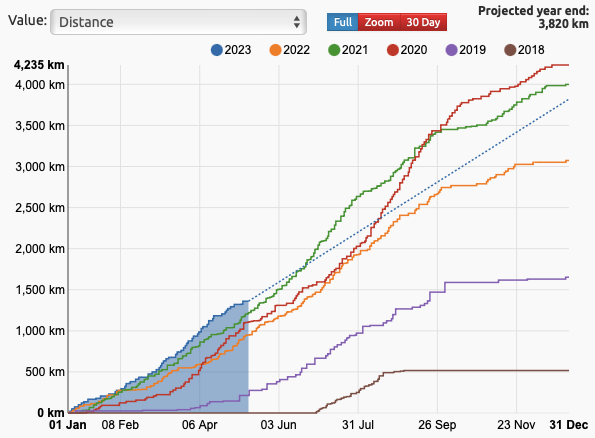
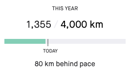

# Status Report

Since the last post there's been quite a lot of change over in my neck of the woods, well and generally in life!

So with that in mind, I thought it high-time that I put a post up here to detail what I've been up to.

<iframe src="https://giphy.com/embed/yj5UdA4elp8Wc" width="480" height="332" frameBorder="0" class="giphy-embed" allowFullScreen></iframe><p><a href="https://giphy.com/gifs/hoppip-hoppip-smoking-arnold-schwarzenegger-yj5UdA4elp8Wc">via GIPHY</a></p>

## Reports

### Professionally

I've moved out of the gambling and entertainment space for now. I'm working in Java at the moment, for the time 
being over in the FinTech world. I'm working as a Software Engineer 
at [10x Banking](https://www.linkedin.com/company/10x-banking/), 
remotely in [Huddersfield](https://goo.gl/maps/o8qTcvcTcBus3aZZ6) working on cloud native banking.

Technology wise, in my spare time, I'm trying to keep active with:
* The Kotlin space! 
* Refresh on some Go knowledge
* Check out Rust, specifically the practice exercises!

But generally re-spark a bit of personal development time. Watch this space for updates, since as intended I'm 
going to push ahead and share it on here.

### Personally

#### Hello World!

Probably the biggest disruption, but very welcome change to my usual antics, is that recently I had a real life ```System.out.println("Hello World");``` 
moment and welcomed my daughter into the world. 

It's been a turbulent period of learning how to cope with a young human, who's
day-to-day routine is eat, sleep, poop, repeat. But it's been incredibly rewarding, humbling, and fulfilling.

However, for the time being this part of my life remains in offline mode. Especially while
we figure out what the hell we're doing!

#### Fitness

I've been hitting the bike all I can recently, especially now since the weather is starting to pick up. It's been 
a bit of death by turbo trainer, due to a mixture of life events and on-call support getting in the way. However,
so far I've managed to get a good amount of distance in both virtually and in real life.

One of the tools in my tool belt for fitness tracking, specifically related to cycling 
is [VeloViewer](https://veloviewer.com). Definitely check it out if you have a Strava account, and would love further insight 
into the stats and metrics! 



Another stat I like to set is my all-time distance goal in Strava, which I'm just about hanging on to at the time of writing!



To add to the above, in a turn of events I've also picked up a bit of running. Late twenties' crisis much?

This was partly inspired by my colleagues at 
10x Banking, spurring on the couch to 10x challenge! I've never been much of a runner. I recall getting awful shin splits
when I was carrying more weight, but I've recently managed to do a few 5ks 
(a mixture of hobbling and walking, but I'm getting there!) and I'm hoping to attend my local park-run soon enough!

Here's a recent 5K and a bit I ran that I was quite impressed with! Although hobbled home afterwords:

<div class="strava-embed-placeholder" data-embed-type="activity" data-embed-id="9045185639"></div><script src="https://strava-embeds.com/embed.js"></script>

The cycling has definitely helped with that, <b>so it's not entirely couch to 5k</b>, more avid peddler-with-a-small-toe-in-the-water-for-triathlon-without-swimming! 

## Other updates

One that's flown largely under the radar is that you can now schedule a call with me via [cal.com](https://github.com/calcom/cal.com). It's such a neat open source calendar alternative
that syncs directly with your favourite calendars! So if you want to catch up about an opportunity, or want to discuss projects 
feel free to slot something in, and I'll get back to you! 

As always though if that doesn't work, find me on my socials linked here. Or comment below and I'll get back to you there too!

