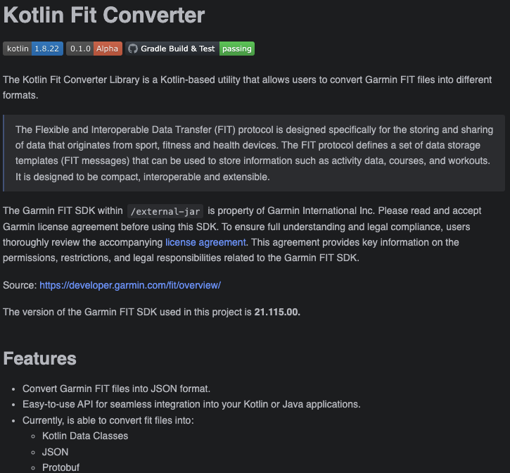

## Introduction

Lately, I've been spending a ton of time delving into FIT files, hence the corny title of this article, to uncover the large amount of information they hold. As I've mentioned in previous posts, I'm an avid cyclist and can often be found roaming around the hills in Huddersfield. Although in most cases I'm crawling slowly up them. Especially if there is a cafe or pub at the top.

Naturally, due to my profession, I've developed a keen interest in gathering as much data as possible. This pursuit has led me to acquire an array of sensors and trackers to stack up these values for my various cycling ventures. For my hardcore stats viewing, I've primarily relied on platforms like [Strava](https://strava.com/) and [VeloViewer](https://veloviewer.com/). The process is all automated through my Wahoo head unit.

While working on various side projects that haven't seen the light of day yet, I've attempted to juggle GPX and TCX files, as they are easily exportable. However, I haven't given much thought to the initial format until I came across FIT. So I decided to write a post about Garmin FIT and share what I've been doing in this area recently.

## What is the FIT protocol?

> The Flexible and Interoperable Data Transfer (FIT) protocol is designed specifically for the storing and sharing of data that originates from sport, fitness and health devices. The FIT protocol defines a set of data storage templates (FIT messages) that can be used to store information such as activity data, courses, and workouts. It is designed to be compact, interoperable and extensible.

_Source: [https://developer.garmin.com/fit/overview/](https://developer.garmin.com/fit/overview/)_

It's quite deep, giving you functionality to create / view:

* GPS Data: Tracks your location, speed, altitude, and route.
* Activity Data: Records details like start time, duration, distance, pace, heart rate, and calories burned.
* Health Metrics: Monitors metrics such as sleep quality, stress levels, respiration rate, and blood oxygen saturation.
* Sensor Data: Supports data from external sensors like heart rate monitors, power meters, and cadence sensors.
* Workout Details: Stores information about workout types, goals, intervals, and lap details.
* Training Plans: Synchronizes and saves training schedules, workouts, and targets.
* Device Settings: Includes user profiles, display preferences, and sensor pairing information.
* Additional Data: Timestamps, device information, and custom data fields.

You can even take the FIT SDK and modify it to include custom message types for your own fitness applications. This is something I'd be interested in exploring, but I don't currently have any devices to experiment with (at least not ones that support custom message types, as far as I know).

### Wahooligan?

I've always chosen Wahoo products as my go-to cycling computing gear. I don't believe Wahoo has a built-in feature to create FIT files, but they do offer the option to export FIT files, which makes sense when thinking about exporting ride data. 

Garmin has held the reins as the dominant market leader in that space long before Wahoo entered the scene. It's worth noting that most online training data platforms are specifically designed to accept FIT files as input.

However, here's the interesting twist: with Wahoo, you actually have access to export FIT files. And that's precisely what I plan to keep looking into!

## Why not GPX or TCX?

These are all perfectly suitable formats that are commonly used. For instance, if you are a Strava user, you'll notice that you can export your workout as a GPX file. There isn't a huge difference between the three formats:

* FIT (Flexible and Interoperable Data Transfer): FIT is a file format created by Garmin for GPS and workout data. It's used by Garmin devices and other fitness trackers to store information like GPS coordinates, heart rate, speed, and more.
* GPX (GPS eXchange Format): GPX is a format for sharing GPS data across different devices and software. It's widely supported and can store waypoints, tracks, routes, and additional details like time stamps and elevation.
* TCX (Training Center XML): TCX is an extension of GPX, also developed by Garmin. It's used for fitness activities and training sessions, including data like GPS coordinates, heart rate, power, and speed. TCX files can be exchanged between various fitness devices and software.

In summary, FIT has been developed by Garmin for Garmin devices primarily. GPX is the common format widely used for GPS data, and TCX is just an extention on GPX created by Garmin for further fitness related data.

## What's FITting in here then?

<iframe src="https://giphy.com/embed/cWvSvMEW6yGY6CGjWT"  frameBorder="0" class="giphy-embed" allowFullScreen></iframe>
<a href="https://giphy.com/gifs/theoffice-episode-12-the-office-tv-cWvSvMEW6yGY6CGjWT">via GIPHY</a>

Couldn't resist. Sorry. 

So, I've talked a lot about FIT files and how amazing they are. But let's get back on track with the article.

A FIT file is a binary file, and trying to manually decode it would be a pain. You'd probably end up losing your hair out and experiencing a lot of frustration. Luckily, that's where the Garmin [FIT SDK](https://developer.garmin.com/fit/overview/) comes in. The FIT SDK provides a set of tools to help you map, model, encode, and decode FIT files. However, it's a pretty complex beast. You'll have plenty of fun digging through the documentation and navigating the different layers of the SDK. It's available in various programming languages, including C, C++, C#, Java, JavaScript, Objective-C, and Python.

Since I have a background in Java, I decided to explore the Java version of the SDK.

### Kotlin Fit Converter Lib

I've put in some serious hours doing the heavy lifting. There's still so much left to dive into. Instead of my usual strategy of constantly delaying and keeping things under wraps, I figured why not share what I've got so far? It's a way to let you in on the progress and get your thoughts on it.

Introducing <b>The Kotlin Fit Converter Lib</b>! :tada: 

As Phil Karlton said: _There are only two hard things in Computer Science: cache invalidation <b>and naming things.</b>_

The source code for the library can be found here: [https://github.com/james-millner/kotlin-fit-converter](https://github.com/james-millner/kotlin-fit-converter)

The library is up and ready on GitHub packages, so you can easily clone it using GitHub packages as a Maven repository. I have a few ideas and improvements in mind that I'd like to implement. However, if you decide to give it a try, I would really appreciate it if you could reach out and let me know your thoughts. I'm curious to hear what works well for you and what could be better. Your feedback would be invaluable!

On the flip side, if you happen to have any particularly interesting FIT files that you think might pique my interest, don't hesitate to get in touch! You can find all the ways to reach me right here. 