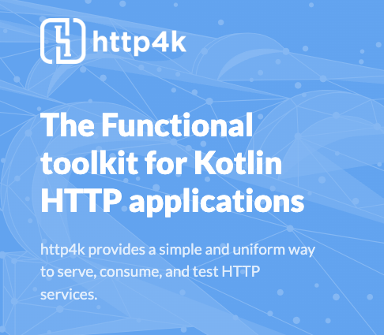

# Introduction 

I'll keep this one brief to be honest. ChatGPT provided some inspiration for a title for this. 

In my spare time, I've been working on a few projects recently around RESTful API's. 
I've been using Spring Boot since the dawn of time, and I'm a big fan of it. However, I've been looking for something a bit more lightweight and Kotlin friendly.

Also, just something a bit different. Something simple, easy to use, and just get running. I think I've found it with HTTP4K.

## What is HTTP4K?

HTTP4K is a lightweight, type-safe, HTTP library written in Kotlin that enables the serving and consuming of HTTP services in a functional and consistent way. 

Designed specifically for Kotlin, it's a bit different from Spring Boot, but it's a nice change of pace.

See the [HTTP4K website](https://www.http4k.org/) for more information.

It's also very recently won a [Kotlin Foundation Grant](https://kotlinfoundation.org/news/grants-program-winners-23/) which proposes to also make it even more lightweight, and
even better; _find the best way to provide Kotlin multiplatform support_. 🤩 

In my opinion, this is a great thing for the Kotlin community, and I'm looking forward to seeing what comes of it. Multiplatform support is something I've briefly looked at, but not really had the time to dive into recently. 

Last time I checked out Multiplatform was way back in February 2020 where I did a brief talk on it for Leeds Kotlin User Group. Unfortunately the Pandemic then hit and pretty much stunted my Kotlin learning for a while. Anyway I digress...

## So Why HTTP4K? Background please?

As I've mentioned a few times, I'm big into cycling, a proud [Wahooligan](https://uk.wahoofitness.com/), and I've been aware of their [Cloud API](https://developers.wahooligan.com/cloud) for some time.

In my previous post I also mentioned I've been looking at FIT files. 
The Wahoo Cloud API gives you access to a variety of workout data, but specifically of interest to me; FIT files. 
So I'm looking to use that to pull down my ride data start to build a set of services around it.

In an effort to learn more about the API itself, I thought I'd have a go with setting up a backend to handle the OAUth 2.0 authentication flow, and then use the API to pull down my ride data - although that's up next, in another chunk of development to come in the future.

However, I've got a small backend application up and available to check out on my [Github.](https://github.com/james-millner/kotlin-wahoo-cloud-api) I've been incredibly impressed with how simple, intuitive, and easy to use HTTP4K is. 

It's live / public now on [Github.](https://github.com/james-millner/kotlin-wahoo-cloud-api)

It consists of:

* An `/authorize` endpoint to handle the OAuth 2.0 flow.
* This calls back to `/` at the moment. But should probably be something more description and not just the root.
* A `/webhook` webhook specific endpoint for Wahoo to send me live updates of future rides. 
  * This will be quite valuable going forward as I could ship off the FIT files into some cloud storage. Or even call another service entirely.

There's a README explaining all the good stuff if you wanted to give it a go!

## What's next?

I've currently been playing around with hosting a version of it on [fly.io](fly.io). It is deployed, but might not stay up for long. I'm still playing around with it.

But it should become part of some larger work / hobby engineering around all things Fitness / Cycling. More to come in the future!