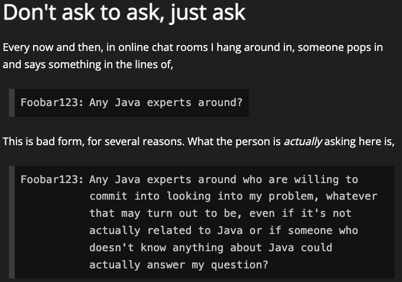

# Introduction

After spending years in the depths of backend development, I decided it was time to try and expand my skillset with some mordern front-end development — a field I've always wanted to get to grips with.

As far as my front-end skills go, let's just say they were at their best when sat in a safe [Thymeleaf](https://www.thymeleaf.org/) template. Don't get me wrong, I've had exposure to React based front-end apps. However these have mostly been existing codebases, that I've been able to modify slowly with lots of existing code to help reinforce my decisions. Starting from a clean slate though however has been challenging!

I'm not going to cover a lot about that hobby development journey here though. More on that to come soon! However in my travels, amoungst many a Stack Overflow thread, Slack Community, Discord Community (quite alot in this space!) I stumbled on an interesting article that really got me thinking. Thinking enough to put some thoughts down here.

# Don't ask to ask

The article in question is: [https://dontasktoask.com](https://dontasktoask.com) 

I'll be honest, when I read this I certainly can put my hand up and say this has been me. But I dont think I'm alone, as there are countless forum posts, threads, messages containing similarily phrased questions and in all walks of life. 

However, I know that in my experience, asking questions in that way wasn't intentionally lazy; rather, it was an attempt to explore information at a more conversational level. I often tend to approach communication with a conversational and empathetic tone, as it's an inherent part of who I am. On reflection though, while in my experience that style of communication can lead to good working relationships, I realize that it may not be the most effective when it comes to seeking help / assistance; especially in online forums, work-wide support channels. In such a setting, a more direct and concise approach is often necessary.

The trouble is these online or remote forums can host a large diverse audience, making it challenging to gauge who is available at any given time, and what their experience is. So often phasing questions in this way may feel like the correct way to ask. I've experienced this first hand gauging other peoples questions and requests through Stack Overflow and Github issues, to name a few. 

As I dug into the topic, I couldn't help but think about the back-and-forth between open-ended questions and straight-to-the-point ones. It got me pondering how these meandering questions sometimes dance around the main point, and can cause both the question giver, and the receiver, might utlimately lose their trail of thought. It hit me that there's a balance to strike. This got me thinking about my own style, and I realized I want to sharpen it up a bit. To start to practice what these articles preach.

Which I owe in thanks to [https://dontasktoask.com](https://dontasktoask.com) and ultimately the [NextJS Discord Server](https://discord.com/invite/bUG2bvbtHy)

I'll also shout out to the subsequent references in that article [The XY Problem](https://xyproblem.info/) & [No Hello](https://nohello.net/) these are both linked in the parent article, but if it helps someone immedietily discover that content through this post, then great! 

I'm a No Hello convert entirely. You'll find me saying hey to folks often followed at the same time with a question! 

