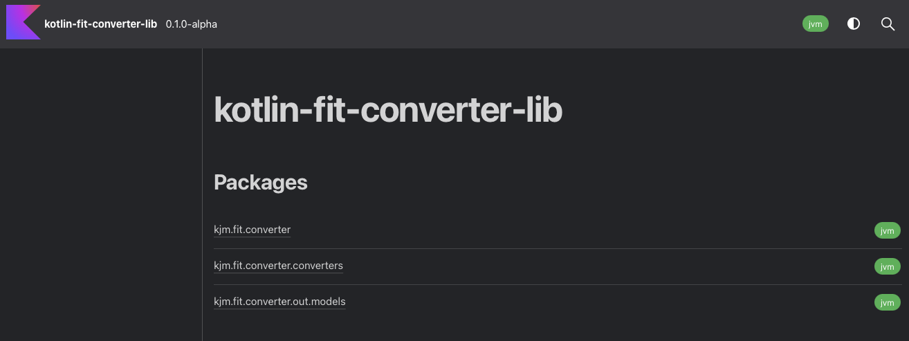
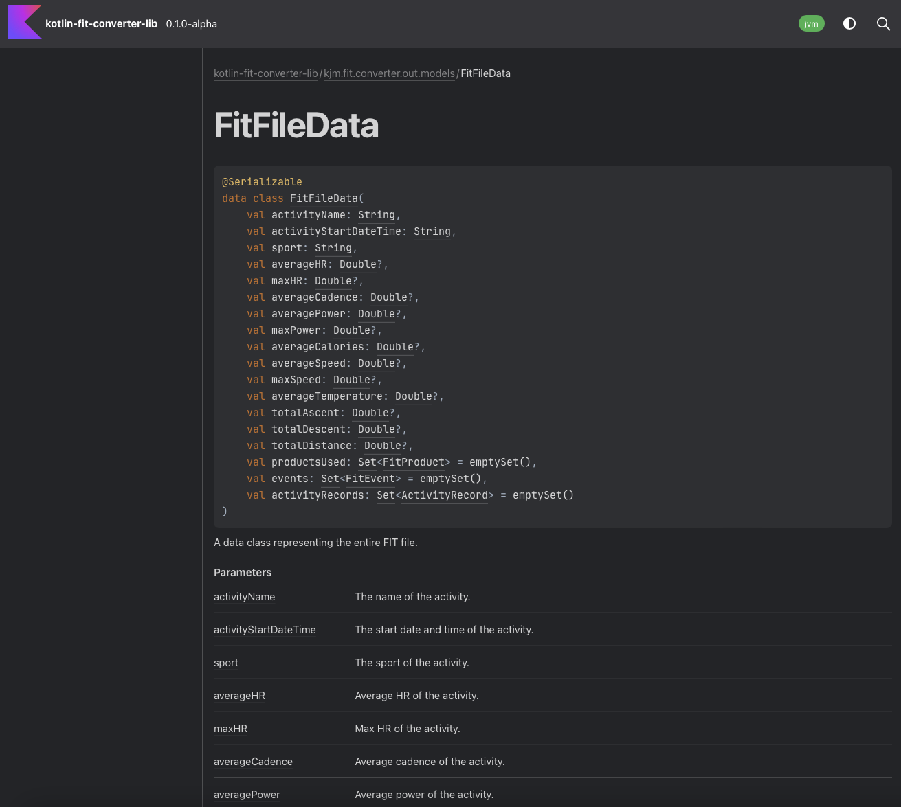

The 'kotlin-fit-converter' repository, as the name suggests, is a Kotlin-based library for handling FIT data conversions. 

For a full background on the library, head to my blog post it's related to [here](/blog/2023/07/08/all-things-fit-%EF%B8%8F/)

It includes:

* Handlers to convert FIT files to:
  * Kotlin Data Classes
  * JSON
  * Protobuf
* Spring-like conversion interface and a generic service. Allowing its users to create their own set of Converters for doing their own FIT conversion.
* Github action workflow for tests. The repository also includes Jacoco for test coverage reports and Maven for publishing to local / Github Packages.
* Dokka generated docs

 
It's a small library based project that I aim to continue to add to. It's currenting running a SemVer versioning strategy. 

Tech wise:

* Gradle Library Project
* Garmin FIT SDK 
* KotlinX Serialization
* Automated workflow to build / publish new versions
* Dokka documentation 

The source code for the library can be found here: [https://github.com/james-millner/kotlin-fit-converter](https://github.com/james-millner/kotlin-fit-converter)
